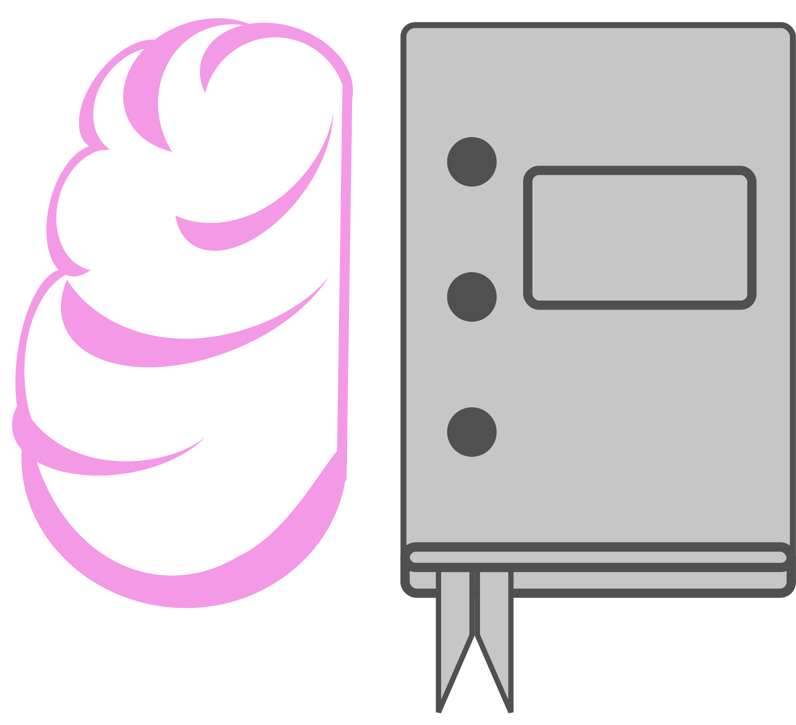

## AcadaBrain

> Your one stop shop for knowledge enrichment



## Installation

```bash
$ npm install
```

### Architecture

- [Nest](https://github.com/nestjs/nest).
- [TypeScript](https://www.typescriptlang.org/).
- [PostgreSQL](https://www.postgresql.org/).
- [Docker Compose](https://docs.docker.com/engine/reference/commandline/compose/).

pre-commit/push hooks setup with [Husky](https://github.com/typicode/husky)

#### Authentication

[Passport.js](https://www.passportjs.org/) is used along with [passport-jwt](http://www.passportjs.org/packages/passport-jwt/) strategy for handling user authentication.

## Running the app

```bash
# development
$ npm run start

# watch mode
$ npm run start:dev

# production mode
$ npm run start:prod
```

## Test

### End-to-End Testing

End-to-End Testing via [Pactum.js](https://pactumjs.github.io/)
(See [E2E Tests](app.e2e-spec.ts))

Tests are ran against a test DB (spun up in a separate docker container).

```bash
# e2e tests
$ npm run test:e2e

# unit tests
$ npm run test

# test coverage
$ npm run test:cov
```

## License

[MIT licensed](LICENSE).
